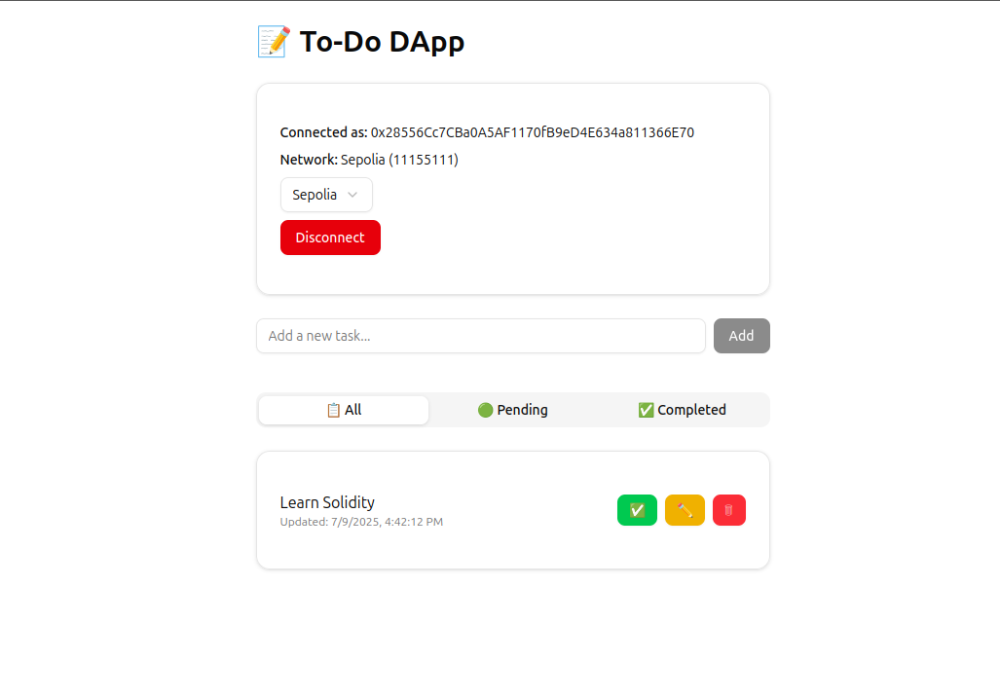

# 📋 Todo DApp — On-chain Task Manager

A decentralized Todo application built with **Next.js 15**, **Wagmi**, **Ethers.js,** and a Solidity smart contract deployed to **Sepolia**.
Manage your tasks on the blockchain — create, update, complete, delete, and fetch them, all on-chain.

---

## 🚀 Features

-✨ On-chain task management
🔗 Wallet connection (MetaMask, WalletConnect, Safe)
🎨 Beautiful UI with ShadCN components
📡 Supports Sepolia testnet
🔄 Switch networks and disconnect with feedback toasts
🔥 Built with TypeScript & React Server Components

---

### 📷 Screenshots



### 🛠️ Tech Stack

- Next.js 15+ (App Router, SSR & CSR)

- Wagmi & Viem (Ethereum client)

- Ethers.js

- Solidity (Smart contract)

- ShadCN/UI (components)

- TailwindCSS

- TypeScript

### 🧪 Smart Contract

---

```solidity
// SPDX-License-Identifier: MIT
pragma solidity ^0.8.28;

contract TodoApp {
    struct Task {
        uint256 id;
        string content;
        bool completed;
        uint256 createdAt;
        uint256 updatedAt;
    }

    mapping(address => Task[]) private userTasks;

    function createTask(string memory _content) external { /* ... */ }
    function updateTask(uint256 _taskId, string memory _content) external { /* ... */ }
    function completeTask(uint256 _taskId) external { /* ... */ }
    function deleteTask(uint256 _taskId) external { /* ... */ }
    function getTask(uint256 _taskId) external view returns (Task memory) { /* ... */ }
    function getAllTasks() external view returns (Task[] memory) { /* ... */ }
}
```

Deployed on: Sepolia Testnet
You can deploy it yourself using [Hardhat](https://hardhat.org/) or [Foundry](https://getfoundry.sh/).

---

### 🧑‍💻 Getting Started

#### Prerequisites

- Node.js ≥ 18

- npm, pnpm or yarn

- MetaMask or another Ethereum wallet

#### Clone the repo

```bash
git clone https://github.com/zntb/nextjs-web3-todo-dapp.git
cd todo-dapp
```

#### Install dependencies

```bash
npm install
# or
yarn install
# or
pnpm install
```

#### Add your WalletConnect Project ID

Add your [WalletConnect Project ID](https://cloud.reown.com/sign-in) to `.env.local`:

```bash
NEXT_PUBLIC_PROJECT_ID=YOUR_PROJECT_ID
```

#### 🚴 Run the app

```bash
npm run dev
# or
yarn dev
# or
pnpm dev
```

Open <http://localhost:3000> in your browser.

### 📝 Tasks

✅ Connect to wallet
✅ Create a task
✅ Update task content
✅ Complete & delete task
✅ Fetch all/completed/pending tasks
✅ Switch networks (Sepolia)
✅ Toast notifications
🚧 Add tests
🚧 Deploy to production

### 📂 Project Structure

```text
.
├── app/               # Next.js app router
│   ├── layout.tsx
│   ├── page.tsx
│   ├── config.ts      # Wagmi config
│   └── globals.css
├── components/        # UI components
│   ├── ConnectButton.tsx
│   └── ui/            # ShadCN components
├── contracts/         # Solidity contract
│   └── TodoApp.sol
├── public/
├── README.md
├── package.json
└── tsconfig.json
```

### 📜 License

This project is licensed under the MIT License - see the [LICENSE](LICENSE) file for details.

### 🤝 Contributing

PRs and suggestions welcome! Please open an issue or pull request if you have ideas to improve the app.

#### 📫 Contact

[zntb](https://github.com/zntb)
